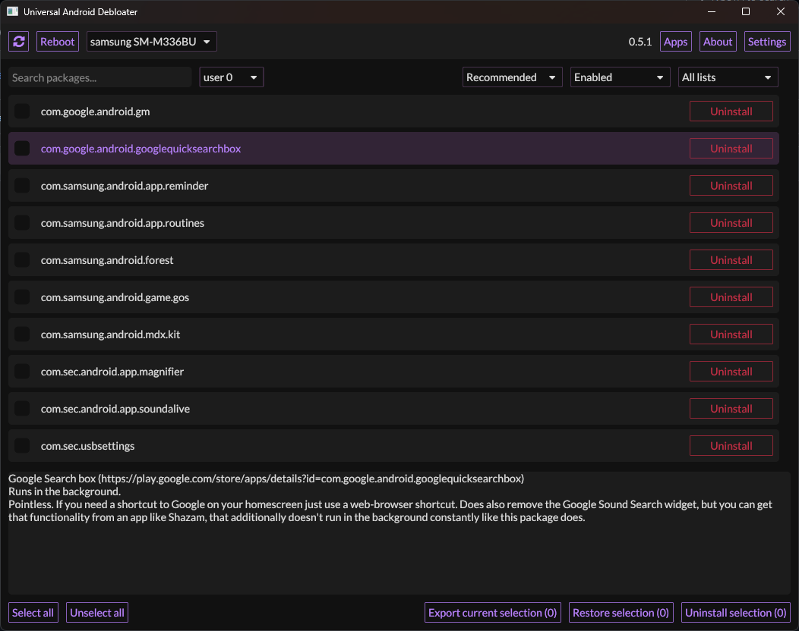

  

<a href="https://github.com/bharathajjarapu/Bloatbuster">
   <h1 align="center">Bloat Buster</h1></a>

Use at your own risk. I am not responsible for anything that could happen to your phone.

## Summary

This is a windows installer for [UAD GUI Project](https://github.com/0x192/universal-android-debloater)
which aims to improve privacy and battery performance by removing unnecessary
and obscure system apps.
This can also contribute to improve security by reducing [the attack surface](https://en.wikipedia.org/wiki/Attack_surface).

Packages are as well documented as possible in order to provide a better
understanding of what you can delete or not. The worst issue that could happen
is removing an essential system package needed during boot causing then an unfortunate
bootloop. After about 5 failed system boots, the phone will automatically reboot
in recovery mode, and you'll have to perform a FACTORY RESET. Make a backup first!

In any case, you **CANNOT** brick your device with this software!
That's the main point, right?

**This software is still in an early stage of development. Check out the issues, and feel free to contribute!**

## Features

- [x] Uninstall/Disable and Restore/Enable system packages
- [x] Multi-user support (e.g. apps in work profiles)
- [x] Export/Import your selection in `uad_exported_selection.txt`
- [x] Multi-device support: you can connect multiple phones at the same time
- [x] All your actions are logged, so you never forget what you've done

NB : System apps cannot truly be uninstalled without root (see the [FAQ](https://github.com/0x192/universal-android-debloater/wiki/FAQ))

## Universal Debloat Lists

- [x] GFAM (Google/Facebook/Amazon/Microsoft)
- [x] AOSP
- [x] Manufacturers (OEM)
- [x] Mobile carriers
- [x] Qualcomm / Mediatek / Miscellaneous

## Manufacturers debloat lists

- [x] Asus
- [ ] Blackberry
- [ ] Gionee
- [x] LG
- [x] Google
- [ ] iQOO
- [x] Fairphone
- [ ] HTC
- [x] Huawei
- [ ] Infinix
- [x] Motorola
- [x] Nokia
- [x] OnePlus
- [x] Oppo
- [x] Realme
- [x] Samsung
- [x] Sony
- [x] Tecno
- [ ] TCL
- [x] Vivo/iQOO
- [x] Xiaomi
- [x] ZTE

## How to use it

- **Read the [FAQ](https://github.com/0x192/universal-android-debloater/wiki/FAQ)!**
- **Do a proper backup of your data! You can never be too careful!**
- Enable _Developer Options_ on your smartphone.
- Turn on _USB Debugging_ from the developer panel. (By Tapping the build number in settings for 5-6 times)
- From the settings, disconnect from any OEM accounts (when you delete an OEM
  account package it could lock you on the lockscreen because the phone can't
  associate your identity anymore)
- Download the latest release of the installer for your Windows [here](https://github.com/bharathajjarapu/Bloatbuster/releases).

**NOTE:** Chinese phones users may need to use the AOSP list for removing some stock
apps because those Chinese manufacturers (especially Xiaomi and Huawei) have been
using the name of AOSP packages for their own (modified & closed-source) apps.

**IMPORTANT NOTE:** You will have to run this software whenever your OEM pushes
an update to your phone as some _uninstalled_ system apps could be reinstalled.
